Part A
======

1. Plasma inorganic phosphate measurements obtained from 13 control and 20 obese patients 0, 0.5, 1, 1.5, 2, and 3 hours after an oral glucose challenge. The investigators intend to test the following hypotheses using Hotelling’s *T*2 statistic. Set up suitable model clearly stating the assumptions. Suggest appropriate contrast matrices for the hypothesis tests proposed by the investigators.
---------------------------------------------------------------------------------------------------------------------------------------------------------------------------------------------------------------------------------------------------------------------------------------------------------------------------------------------------------------------------------------------------------------------

Set up the model as: *Y* = *X**B* + *E*, and we assume:

-   *y**s**i* ∼ *M**V**N*(*μ**s**i*, *Σ*)

-   each group has its own *μ**s**i*

-   *Σ* is the same across groups

The null hypothesis has the general form as *A**B**C* = *D*, where

$$
B = \\begin{pmatrix}
  \\mu\_{11} & \\mu\_{12} & \\mu\_{13} & \\mu\_{14} & \\mu\_{15} & \\mu\_{16} \\\\
  \\mu\_{21} & \\mu\_{22} & \\mu\_{23} & \\mu\_{24} & \\mu\_{25} & \\mu\_{26} \\\\
\\end{pmatrix} \\\\
$$

### (a) To test the null hypothesis that the group means are the same at all six measurement times.

$$
\\begin{split}
A &= \\begin{pmatrix}
  1 & -1 \\\\
\\end{pmatrix} \\\\
C &= I\_{6} \\\\
D &= \\bf{0}\_{2\\times 6}
\\end{split}
$$

### (b) To test whether the profiles in the two groups are parallel.

$$
\\begin{split}
A &= \\begin{pmatrix}
  1 & -1 \\\\
\\end{pmatrix} \\\\
C &= \\begin{pmatrix}
  1 & 0 & 0 & 0 & 0 \\\\
  -1 & 1 & 0 & 0 & 0 \\\\
  0 & -1 & 1 & 0 & 0 \\\\
  0 & 0 & -1 & 1 & 0 \\\\
  0 & 0 & 0 & -1 & 1 \\\\
  0 & 0 & 0 & 0 & -1 \\\\
\\end{pmatrix} \\\\
D &= \\bf{0}\_{1\\times 5}
\\end{split}
$$

### (c) To test whether the differences in means at 2 and 3 hours after an oral glucose challenge are different between the control and obese patients.

We need to test whether
*μ*15 − *μ*25 = *μ*16 − *μ*26

$$
\\begin{split}
A &= \\begin{pmatrix}
  1 & -1 \\\\
\\end{pmatrix} \\\\
C &= \\begin{pmatrix}
  0 \\\\ 0 \\\\ 0 \\\\ 0 \\\\ 1 \\\\ -1 \\\\
\\end{pmatrix} \\\\
D &= \\begin{pmatrix} 0 \\end{pmatrix}
\\end{split}
$$

Part B
======

1. Exposure to lead can produce cognitive impairment, especially among young children and infants. Interventions known as chelation treatments can help a child to excrete the lead that has been ingested. A chelating agent known as Succimer can be administered orally leading to urinary excretion of lead, unlike previous treatments which required injections and hospitalization. The Treatment of Lead- Exposed Children (TLC) trial was a placebo-controlled, randomized study of succimer (a chelating agent) in children with blood lead levels of 20-44 micrograms/dL. These data (TLC.dat) consist of subject id, assignment to chelation treatment with succimer or placebo and four repeated measurements of blood lead levels obtained at baseline (or week 0), week 1, week 4, and week 6 on 100 children who were randomly assigned to chelation treatment with succimer or placebo.
--------------------------------------------------------------------------------------------------------------------------------------------------------------------------------------------------------------------------------------------------------------------------------------------------------------------------------------------------------------------------------------------------------------------------------------------------------------------------------------------------------------------------------------------------------------------------------------------------------------------------------------------------------------------------------------------------------------------------------------------------------------------------------------------------------------------------------------------------------------------------------------------------------

From Fig.1 to Fig.3, we can hardly tell if the blood lead level is
decreasing through time in treatment group. But there exists difference
between treatment and control group.

From Fig.4 and Fig.5, we can see that there is strong correlation
between weeks close in time, and week effect differs between treament
and placebo group.

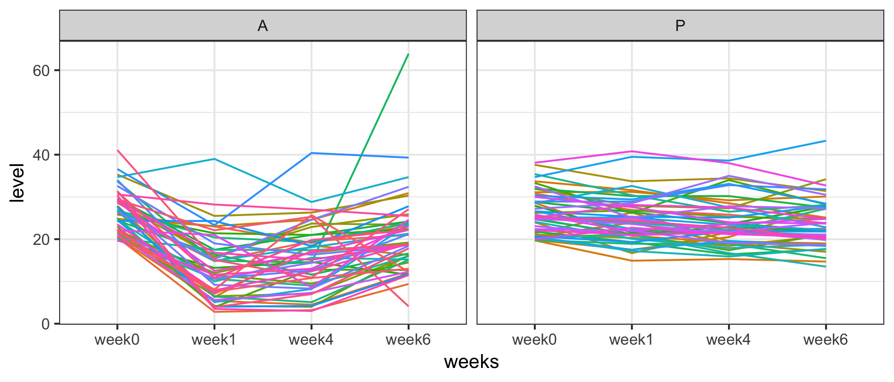

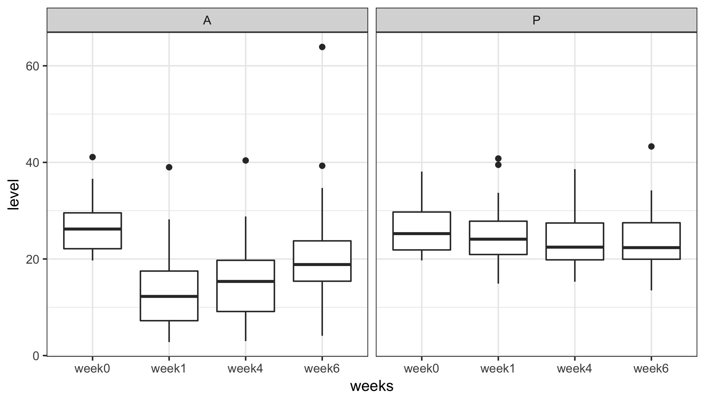

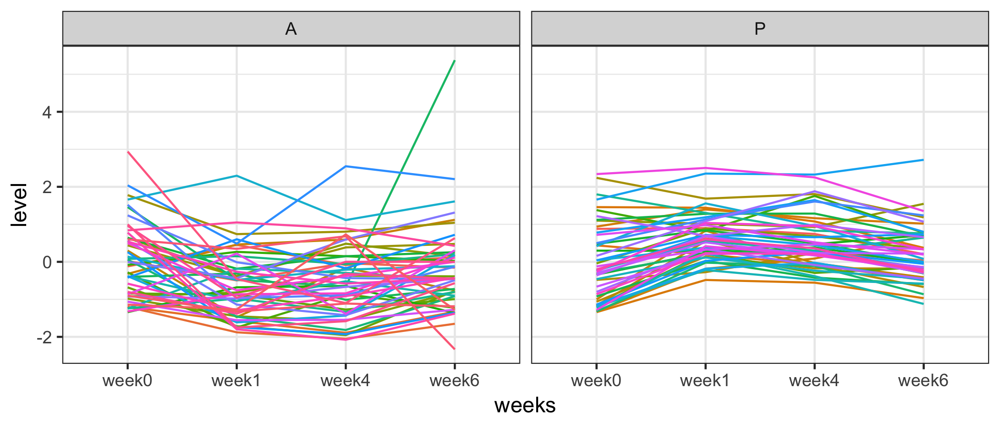

    1: 1187.3
    2: 1160
    Final: 1159.9

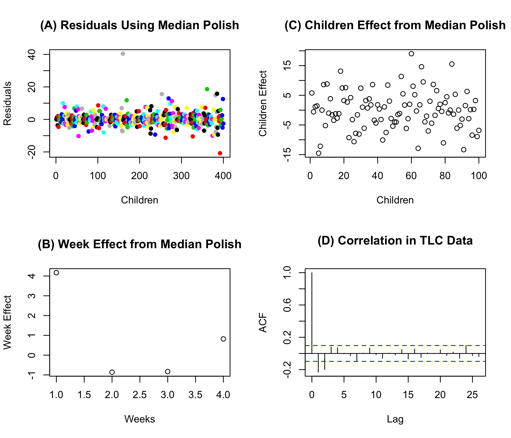

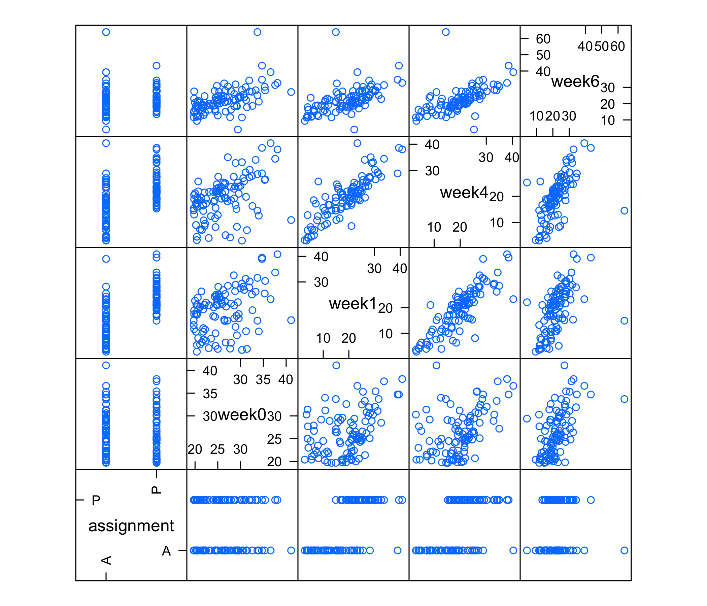

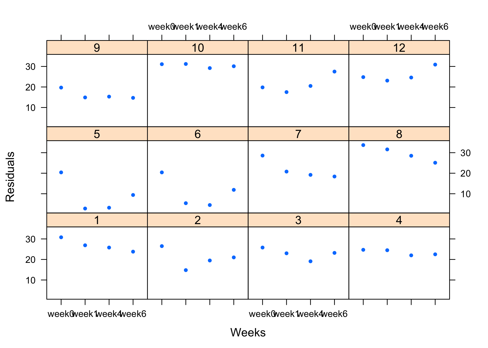

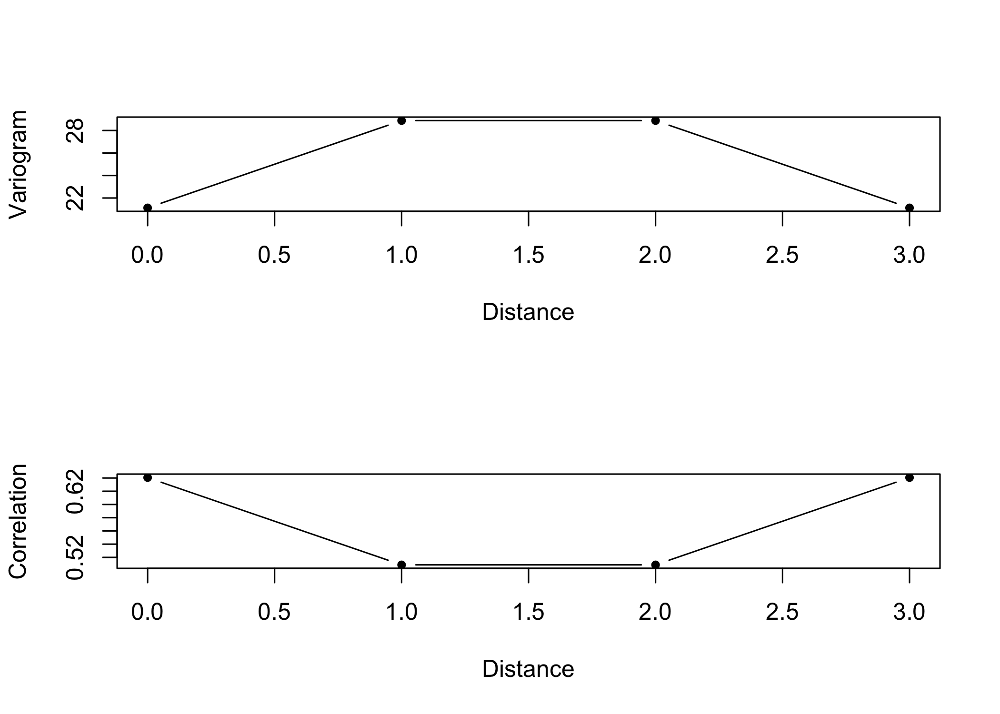

2. The data (dental.dat) are from a study of dental growth measurements of the distance (mm) from the center of the pituitary gland to the pteryomaxillary fissure were obtained on 11 girls and 16 boys at ages 8, 10, 12, and 14. The variables consist of ID, Gender, and responses at ages 8,10,12 and 14.
--------------------------------------------------------------------------------------------------------------------------------------------------------------------------------------------------------------------------------------------------------------------------------------------------------------

From Fig.6 to Fig.8, we can hardly tell if the distance is increasing
through time. But there exists difference between male and femal.

From Fig.9 and Fig.10, we can see that there is strong correlation
between weeks close in time, and distance increase as age effect
increase.

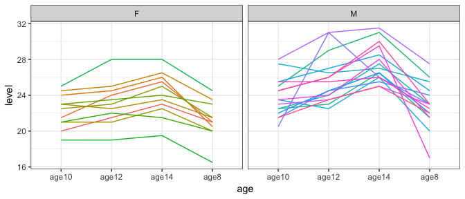

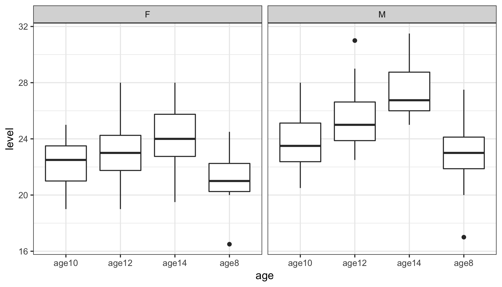

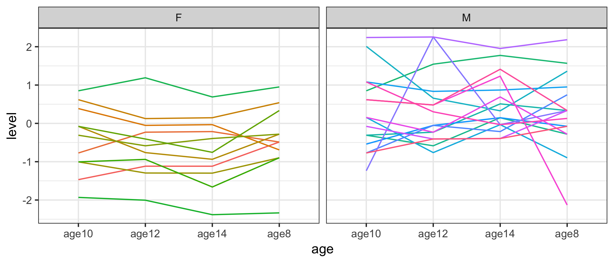

    1: 90.5
    2: 87
    Final: 87

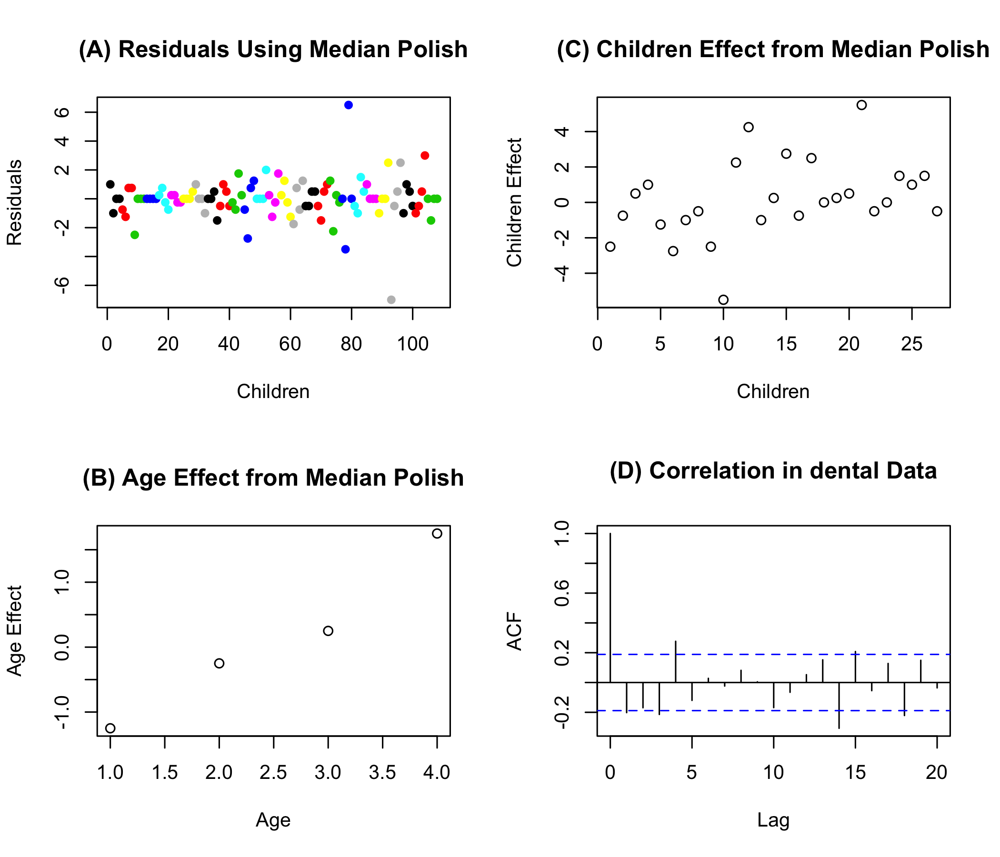

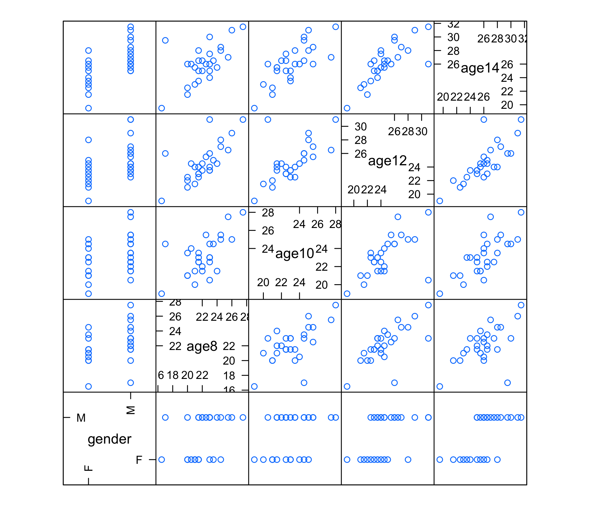

3. The data for the Plasma inorganic phosphate measurements from 13 control and 20 obese patients describe in question 2 of part A are available in the file ZERBE2.dat. Carry out the Hotelling’s *T*2 test to test the hypotheses proposed above in part A. Perform EDA and provide any insights available from exploration. The data has the following information:
---------------------------------------------------------------------------------------------------------------------------------------------------------------------------------------------------------------------------------------------------------------------------------------------------------------------------------------------------------------------------------

-   Column 1 : Group (control=1,Obese=2)

-   Column 2 : Subject id

-   Columns 2-8 : Plasma inorganic phosphate measurements 0, 0.5, 1,
    1.5, 2, and 3 hours after an oral glucose challenge

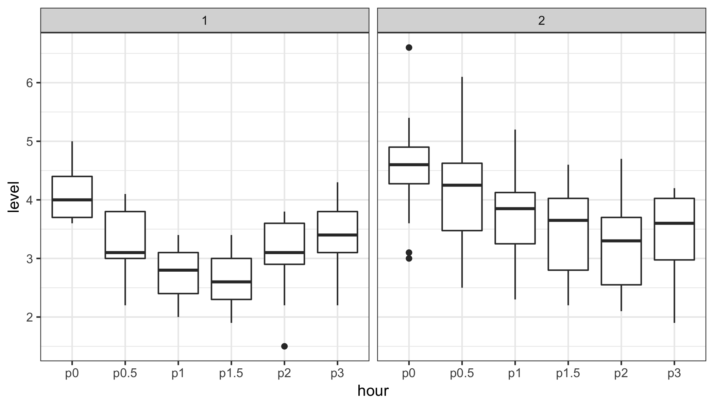

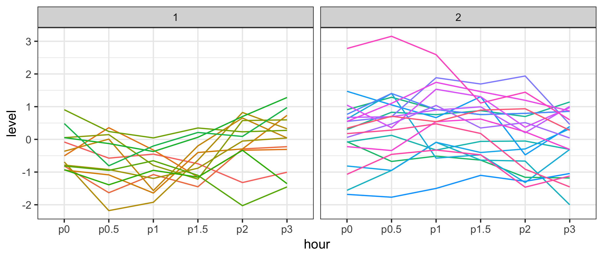

    1: 64
    2: 60.5
    Final: 60.05

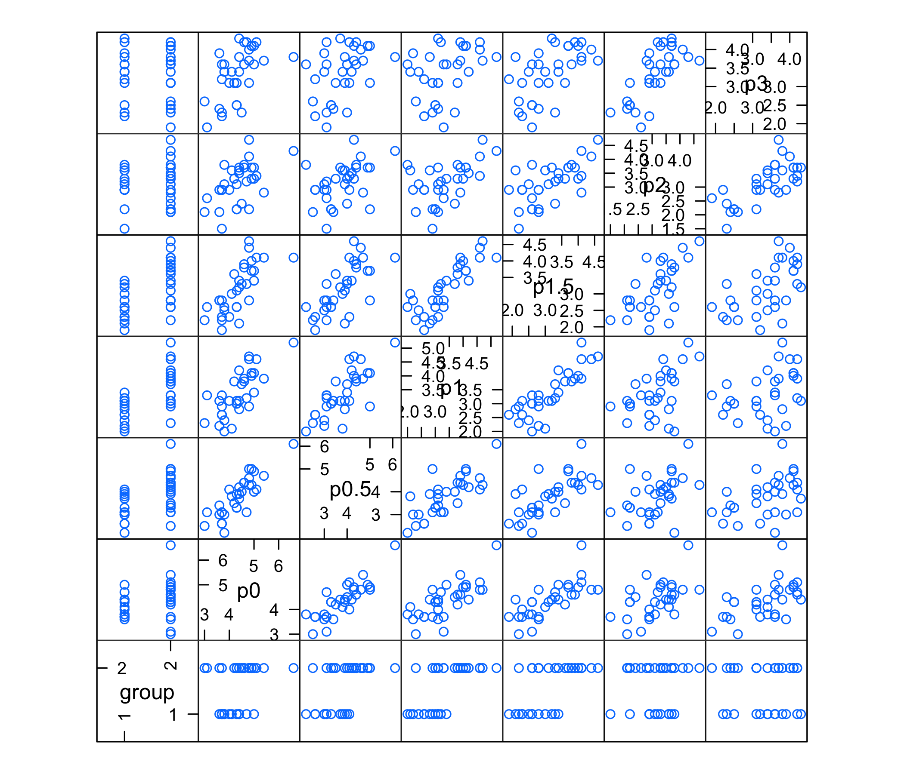

Perfrom Hotelling's *T*2 test, here we assume that:

-   each patients data follow MVN

-   number of time points (p) &lt; number of subjects (n)

-   *Σ*1 = *Σ*2

1.  we assume non parallelism, so we test two groups seperately by using
    two-sample Hotelling's *T*2 test, we calculate the pvalue
    = 0 &lt; 0.05, so we reject the null hypothesis and conclude that
    there is not enough evidence to support that control group means are
    the same at all six measurement times

also try to calculate manually by using covariance matrix S:

$$
\\begin{split}
S &= \\frac{(n\_{1} - 1)S\_{1} + (n\_{2} - 1)S\_{2}}{n\_{1} + n\_{2} - 2} \\\\
T\_2 &= \\frac{n\_{1}n\_{2}}{n\_{1} + n\_{2}}(\\overline{y\_{1}} - \\overline{y\_{2}})'S^{-1}(\\overline{y\_{1}} - \\overline{y\_{2}}) \\sim T^2\_{t, n\_{1} + n\_{2} - 2, \\delta} \\\\
F &= \\frac{n\_{1} + n\_{2} - 2 - t - 1}{(n\_{1} + n\_{2} - 2)t}T^2 \\sim F\_{t, n\_{1} + n\_{2} -t - 1, \\delta} \\\\
where: \\\\
t &= 6 \\\\
n\_{1} &= 13 \\\\
n\_{2} &= 20 \\\\
\\end{split}
$$

we got the same pvalue = 0

1.  By using two-sample Hotelling's *T*2 test, we calculate
    the pvalue = 0 &lt; 0.05, so we reject the null hypothesis and
    conclude that there is not enough evidence to support that the
    profiles in the two groups are parallel

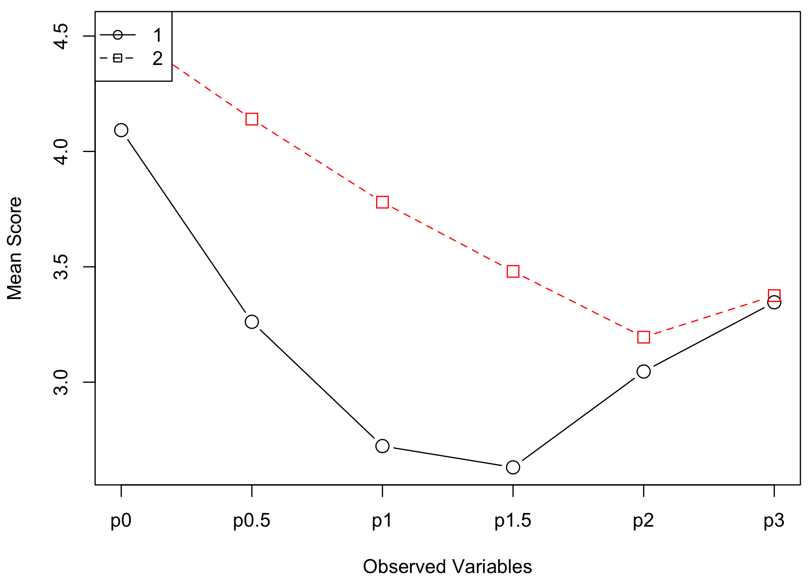

1.  By using two-sample Hotelling's *T*2 test, we calculate
    the pvalue = 0.523 &gt; 0.05, so we fail to reject the null
    hypothesis and conclude that there is enough evidence to support
    that the differences in means at 2 and 3 hours after an oral glucose
    challenge are different between the control and obese patients

Appendix
--------

    knitr::opts_chunk$set(echo = FALSE, message = FALSE, warning = FALSE, comment = "")
    library(lattice) # for xyplot and SPLOM
    library(profileR) # for profile analysis
    library(nlme) # for variogram
    library(ICSNP) # for hotelling T2 test
    library(mvtnorm)
    library(tidyverse)
    options(knitr.table.format = "latex")
    theme_set(theme_bw())
    # EDA for TLC data
    TLC = read.table("TLC.dat", header = F) %>% 
      rename(id = V1, assignment = V2, week0 = V3, week1 = V4, week4 = V5, week6 = V6) %>% 
      mutate(id = as.factor(id)) %>% 
      as.tibble()

    # scatterplot
    TLC %>% gather(week0:week6, key = "weeks", value = "level") %>% 
      ggplot(aes(x = weeks, y = level, group = id, color = id)) +
      geom_line() +
      facet_grid(. ~ assignment) +
      theme(legend.position = "none")

    # boxplot about mean and sd
    TLC %>% gather(week0:week6, key = "weeks", value = "level") %>% 
      ggplot(aes(x = weeks, y = level, group = weeks)) +
      geom_boxplot() +
      facet_grid(. ~ assignment) +
      theme(legend.position = "none")

    # standardized time plot
    TLC2 <- sweep(TLC[,c(3:6)], 2, apply(TLC[,c(3:6)], 2, mean))
    sd1 <- apply(TLC[,c(3:6)], 2, sd)
    TLC2 <- sweep(TLC2, 2, sd1, FUN = "/")
    TLC2 <- cbind(TLC[,c(1:2)], TLC2)
    TLC2 %>% gather(week0:week6, key = "weeks", value = "level") %>% 
      ggplot(aes(x = weeks, y = level, group = id, color = id)) +
      geom_line() +
      facet_grid(. ~ assignment) +
      theme(legend.position = "none")

    # median polish
    junk1 <- medpolish(TLC[,c(3:6)])
    res <- junk1$res
    cols <- rep(1:100, rep(4, 100))
    par(mfcol = c(2, 2))
    plot(as.vector(t(res)), col = cols, pch = 19, cex = 0.8, 
         xlab = "Children", ylab = "Residuals", main = "(A) Residuals Using Median Polish")
    plot(junk1$col ,xlab = "Weeks", ylab = "Week Effect", main = "(B) Week Effect from Median Polish")
    plot(junk1$row, xlab = "Children", ylab = "Children Effect", main = "(C) Children Effect from Median Polish")
    acf(as.vector(t(res)), xlab = "Lag", main = "(D) Correlation in TLC Data")

    # SPLOM
    splom(TLC[2:6], xlab = NULL)

    # correlation structure
    TLC3 = TLC %>% 
      gather(week0:week6, key = "week", value = "level") %>% 
      select(id, week, level) %>% 
      mutate(week = as.factor(week)) %>% 
      arrange(id)
    xyplot(level ~ week | id, data = TLC3[1:(4*12),], pch = 20, xlab = "Weeks", ylab = "Residuals")

    # variogram
    weeknum = str_replace(TLC3$week, c("week0", "week1", "week4", "week6"), c("0", "1", "2", "3"))
    weeknum = as.integer(weeknum)
    u <- lapply(1:(nrow(TLC3) - 1), function(i){abs(weeknum[i] - weeknum[-c(1:i)])})
    gam1 <- Variogram(TLC3$level, unlist(u))
    gam2<-gam1$variog
    u2<-gam1$dist
    ylims=range(gam2)
    xlims<-range(u2)
    junk<-loess.smooth(u2,gam2,evaluation=length(u2),span=0.25)
    sid = TLC3$id
    sigma<-lapply(1:(length(TLC3) - 1), function(i){TLC3$level[i] - TLC3$level[sid != sid[i]]})
    sigma<-mean(((unlist(sigma))^2)/2)
    junk<-split(gam2,u2)
    gam2<-sapply(junk,median)
    par(mfcol=c(2,1))
    plot(0:3,gam2,pch=20,xlab="Distance",ylab="Variogram",type="b")
    abline(h=sigma,lty=2)
    rho2<-1-(gam2/sigma)
    plot(0:3,rho2,pch=20,xlab="Distance",ylab="Correlation",type="b")
    # load dental data
    dent = read.table("dental.dat", header = F) %>% 
      rename(id = V1, gender = V2, age8 = V3, age10 = V4, age12 = V5, age14 = V6) %>% 
      mutate(id = as.factor(id)) %>% 
      as.tibble()

    # scatterplot
    dent %>% gather(age8:age14, key = "age", value = "level") %>% ggplot(aes(x = age, y = level, group = id, color = id)) + geom_line() +
    facet_grid(. ~ gender) +
    theme(legend.position = "none")

    # boxplot about mean and sd
    dent %>% gather(age8:age14, key = "age", value = "level") %>% 
      ggplot(aes(x = age, y = level, group = age)) +
      geom_boxplot() +
      facet_grid(. ~ gender) +
      theme(legend.position = "none")

    # standardized time plot
    dent2 <- sweep(dent[,c(3:6)], 2, apply(dent[,c(3:6)], 2, mean))
    sd2 <- apply(dent[,c(3:6)], 2, sd)
    dent2 <- sweep(dent2, 2, sd2, FUN = "/")
    dent2 <- cbind(dent[,c(1:2)], dent2)
    dent2 %>% gather(age8:age14, key = "age", value = "level") %>% 
      ggplot(aes(x = age, y = level, group = id, color = id)) +
      geom_line() +
      facet_grid(. ~ gender) +
      theme(legend.position = "none")

    # median polish
    junk2 <- medpolish(dent[,c(3:6)])
    res2 <- junk2$res
    cols2 <- rep(1:27, rep(4, 27))
    par(mfcol = c(2, 2))
    plot(as.vector(t(res2)), col = cols2, pch = 19, cex = 0.8, 
         xlab = "Children", ylab = "Residuals", main = "(A) Residuals Using Median Polish")
    plot(junk2$col ,xlab = "Age", ylab = "Age Effect", main = "(B) Age Effect from Median Polish")
    plot(junk2$row, xlab = "Children", ylab = "Children Effect", main = "(C) Children Effect from Median Polish")
    acf(as.vector(t(res2)), xlab = "Lag", main = "(D) Correlation in dental Data")

    # SPLOM
    splom(dent[2:6], xlab = NULL)

    # load dental data
    plasma = read.table("ZERBE2.DAT", header = F) %>% 
      rename(group = V1, id = V2, p0 = V3, p0.5 = V4, p1 = V5, p1.5 = V6, p2 = V7, p3 = V8) %>% 
      mutate(id = c(1:33),
             id = as.factor(id),
             group = as.factor(group)) %>% 
      as.tibble()

    # boxplot about mean and sd
    plasma %>% gather(p0:p3, key = "hour", value = "level") %>% 
      ggplot(aes(x = hour, y = level, group = hour)) +
      geom_boxplot() +
      facet_grid(. ~ group) +
      theme(legend.position = "none")

    # standardized time plot
    plasma2 <- sweep(plasma[,c(3:8)], 2, apply(plasma[,c(3:8)], 2, mean))
    sd3 <- apply(plasma[,c(3:6)], 2, sd)
    plasma2 <- sweep(plasma2, 2, sd3, FUN = "/")
    plasma2 <- cbind(plasma[,c(1:2)], plasma2)
    plasma2 %>% gather(p0:p3, key = "hour", value = "level") %>% 
      ggplot(aes(x = hour, y = level, group = id, color = id)) +
      geom_line() +
      facet_grid(. ~ group) +
      theme(legend.position = "none")

    # median polish
    junk3 <- medpolish(plasma[,c(3:8)])
    res3 <- junk3$res
    cols3 <- rep(1:33, rep(6, 33))
    par(mfcol = c(2, 2))
    plot(as.vector(t(res3)), col = cols3, pch = 19, cex = 0.8, 
         xlab = "Children", ylab = "Residuals", main = "(A) Residuals Using Median Polish")
    plot(junk3$col ,xlab = "Hour", ylab = "Hour Effect", main = "(B) Hour Effect from Median Polish")
    plot(junk3$row, xlab = "Patients", ylab = "Patiens Effect", main = "(C) Patiens Effect from Median Polish")
    acf(as.vector(t(res3)), xlab = "Lag", main = "(D) Correlation in plasma Data")

    # SPLOM
    splom(plasma[c(1,3:8)], xlab = NULL)

    # Hotelling T test
    # for (a)
    x11 = plasma %>% 
      filter(group == 1) %>% 
      select(p0:p3)
    x12 = plasma %>% 
      filter(group == 2) %>% 
      select(p0:p3)
    H11 = HotellingsT2(as.matrix(plasma[,3:8]) ~ plasma$group)

    # mannualy calculation F statistics and p-value
    S = ((nrow(x11) - 1) * cov(x11) + (nrow(x12) - 1) * cov(x12)) / (nrow(x11) + nrow(x12) - 2)
    TSquare = nrow(x11) * nrow(x12) * t(apply(x11,2,mean) - apply(x12,2,mean)) %*% solve(S) %*% t(t(apply(x11,2,mean) - apply(x12,2,mean))) / (nrow(x11) + nrow(x12))
    Ftest = TSquare * (nrow(x11) + nrow(x12) - 2 - 6 + 1) / ((nrow(x11) + nrow(x12) - 2) * 6)
    pvalue = pf(Ftest, df1 = 6, df2 = nrow(x11) + nrow(x12) - 7, lower.tail = F)
    # for (b)
    x21 = plasma %>% 
      filter(group == 1) %>% 
      select(p0:p3) %>% 
      as.matrix()
    x22 = plasma %>% 
      filter(group == 2) %>% 
      select(p0:p3) %>% 
      as.matrix()
    C2 = matrix(c(c(1,-1,0,0,0,0),
                  c(0,1,-1,0,0,0),
                  c(0,0,1,-1,0,0),
                  c(0,0,0,1,-1,0),
                  c(0,0,0,0,1,-1)), nrow = 6)
    H2 = HotellingsT2(rbind(x21 %*% C2, x22 %*% C2) ~ plasma$group)

    # profile analysis
    profiling = pbg(plasma[,3:8], plasma$group, profile.plot = TRUE, original.names = TRUE)

    # for (c)
    x31 = plasma %>% 
      filter(group == 1) %>% 
      select(p0:p3) %>% 
      as.matrix()
    x32 = plasma %>% 
      filter(group == 2) %>% 
      select(p0:p3) %>% 
      as.matrix()
    C3 = matrix(c(0,0,0,0,1,-1), nrow = 6)
    H3 = HotellingsT2(rbind(x31 %*% C3, x32 %*% C3) ~ plasma$group)
